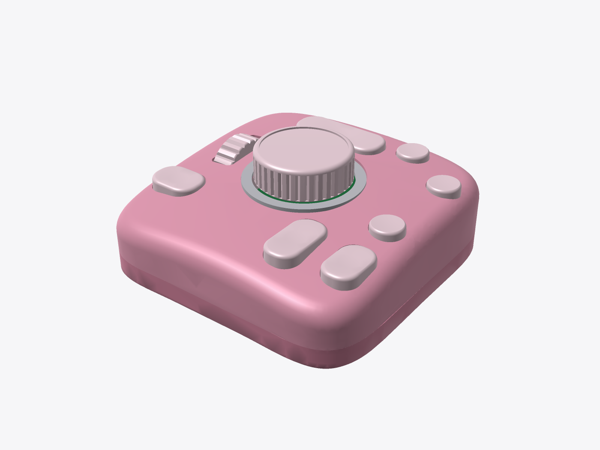
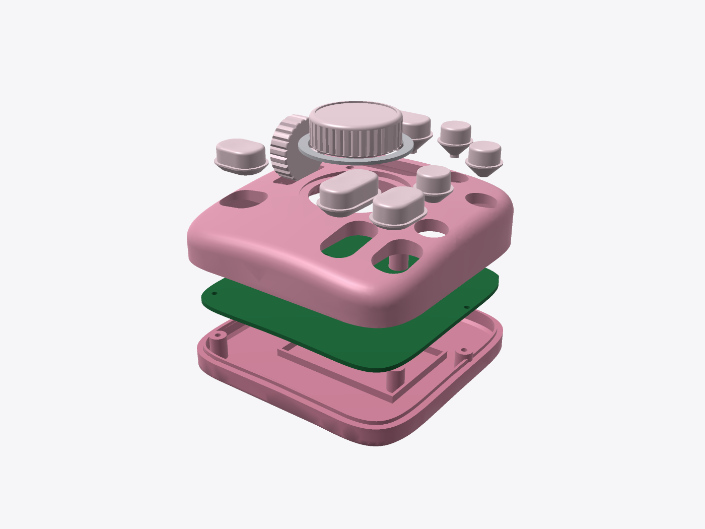

# CreativeDial 创意软件控制器 — 设计交付包 (Rev A, 原型阶段)

> 一款对标 TourBox 功能的**原创**桌面控制器：外形、布局细节、名称均为自主设计，未使用 TourBox 的外观/商标。
> 本包是 **"可以开始打样" 的工程原型包**，不是已经过验证的量产包。请务必阅读第 9 节"尚需实物验证的事项"。

## 1. 概述
| 项目 | 规格 |
|---|---|
| 外形 | 约 95 × 94 × 30 mm（含旋钮约 40 mm）。超椭圆(squircle n=4.2) 轮廓，四边带内凹"腰线"(前 5 / 后 2.5 / 左右 3 mm)；顶面 R300 球面拱，最高点偏后(y=+20)，前沿约 22.6 mm、后沿约 28.8 mm，形成后高前低的掌托斜面；R7 枕形上沿 + R5 底边，侧面呈柔和鼓包。键帽凸出 2.2 mm 带 R40 凹形指窝，旋钮滚花 + 嵌入式装饰环，滚轮约凸出 6 mm。粉色 PC/ABS |
| 主控 | **乐鑫 ESP32-S3-WROOM-1-N16R8**（LCSC C2913202） |
| 连接 | USB-C 有线（原生 USB HID 键盘 + 多媒体 + CDC 串口配置） + 蓝牙 BLE HID 无线 |
| 电池 | 3.7 V LiPo 603450 1000 mAh，MCP73831 充电 300 mA，P-MOS 电源路径(负载共享)，滑动电源开关，USB 插入检测；**电芯须自带保护板** |
| 输入 | 7 个面板按键(8 个轻触开关，长键用 2 个并联)、旋钮(EC11 带按压)、滚轮(鼠标编码器 + 按压)、共 9 路按键 + 2 路编码器 |
| 指示 | WS2812B RGB 状态灯(经 SN74LV1T34 电平转换) + 导光柱（充电=橙，充满=绿，BLE 已连=蓝，仅 USB=暗青，低电=灭） |
| 功能(默认 Photoshop 配置) | 橡皮擦、旋转画布、智能笔刷大小、不透明度、缩放画布、适合屏幕、撤销/重做、吸管、工具轮盘、移动画布(按住空格)、新建图层、画笔、单击/双击/长按、按住键+旋钮组合 |

**MCU 选型理由**：ESP32-S3 同时具备原生 USB-OTG (TinyUSB HID) 和 BLE 5，一颗模组实现有线+无线，模组自带天线/晶振/Flash 并已有 SRRC/CE/FCC 认证，可省去射频认证中最贵的部分。
RP2040 便宜约 2 美元但无无线；若只做有线版，可把 U1 换成 RP2040 方案（固件需移植，本包未提供）。


## 1.1 人体工学设计说明（左手操作）
| 控件 | 位置 (mm, 中心为原点) | 对应手指 / 理由 |
|---|---|---|
| 侧键(圆角豆形 18×13) | (-34,-20) 左下 | 左手自然放置时**拇指**落点；用于撤销/修饰键组合，最高频操作不需移动手掌 |
| 滚轮 Ø24 | (-38, 6) 左侧竖向 | **食指**向左外侧轻拨，与鼠标滚轮动作一致（缩放画布） |
| 顶部胶囊长键 34×13 | (-6, 31) | **食指/中指**向前伸即可按到；胶囊形对指腹宽度容错大（橡皮擦/平移） |
| 旋钮 Ø32 + Ø40 凹环 | (0, 2) 中央 | 位于食指-中指下方，手掌搭在前沿时可用两指捏转（笔刷大小/旋转画布），凹环防误触外壳 |
| 右上小圆键 ×2 Ø11 | (22,36) (38,25) | 中指/无名指上抬触达，用于不常用的吸管/画笔 |
| 右侧圆键 Ø11 | (36,-5) | 无名指（适合屏幕/新建图层） |
| 右下长键 12×22 / 12×18 | (18,-26) (36,-25) | **无名指/小指**下压，长条形适合"按住"类操作（按住空格平移、按住 Alt） |

- 所有按键中心距 ≥ 18 mm（最小值 18.0 mm：右下两长键；19.4 mm：右上两圆键），戴手套或指甲较长也不易误触。
- 后高前低约 6 mm 坡度 + 前沿内凹腰线：手掌根部可以搭在前沿，手腕伸展角更小。
- 键帽顶面为 R40 浅凹指窝、所有棱边 R1.2 倒圆；按键力 160 gf(TS-1102S)，行程约 0.3 mm 空行程 + 0.25 mm 开关行程（偏短，见第 9 节）。
- 底部 4 个 Ø10×0.8 mm 硅胶脚垫槽，防滑。
- 布局为原创：控件数量/功能与参考产品相当，但轮廓、按键形状和坐标均为独立设计。




## 2. 目录结构
```
mechanical/   CadQuery 参数化源码(params.py, cad.py, print_export.py)、out/*.step *.stl(装配姿态)、drawings/ 渲染与尺寸图
print/        FDM 打印就绪 STL(已按打印床摆放)、3MF 拼版、公差测试件、overhang_report.json
pcb/          KiCad 工程(.kicad_pro/.kicad_sch/.kicad_pcb)、生成脚本、fab/ 生产文件(Gerber zip、BOM、CPL、原理图 PDF、ERC/DRC 报告)
firmware/     PlatformIO 工程(Arduino-ESP32)、bin/ 已编译固件
software/     跨平台配置工具 creativedial_config.py (Python + Tkinter + pyserial)
docs/         本文档、3D打印说明.md、images/ 渲染图
```

## 3. BOM 与成本估算
详细见 `pcb/fab/BOM_detailed.csv`（含 LCSC 号、JLC 库存、Basic/Extended、单价、链接；JLC 上传格式为 `BOM_JLCPCB.csv`）。数据为 2026-10-08 由 JLC 元件库接口实时查询，核验表与说明见 **[审查报告.md](审查报告.md)**；下单前请再确认库存。

| 类别 | 主要器件 | 单台估算 |
|---|---|---|
| 电子元件 | ESP32-S3 模组 $5.1、EC11E $2.4、PCM12 $1.8、MCP73831、AP2112K、USBLC6、SN74LV1T34、USB-C、9+2 轻触开关、阻容（1+ 单价） | ≈ $12.3（100 台档约 $9） |
| PCB + SMT (JLC, 100 片) | 2 层 1.6 mm 93×93；SMT 单面；扩展件费每种 $3 一次性 | ≈ $2.5–4 |
| 鼠标编码器 + 微动、电池 603450 1000 mAh | 淘宝/1688 | ≈ $2.5 |
| 外壳 + 键帽 + 旋钮 + 滚轮 | 3D 打印(树脂) ¥40–70/套；注塑 ¥4–8/套 | 打样 ≈ $8 / 量产 ≈ $1 |
| 螺丝、脚垫、导光柱、包装 | | ≈ $0.8 |
| **合计** | | **打样(5–10 台) ≈ ¥200–300/台；量产(1k 台) ≈ ¥90–120/台(不含模具)** |
| 一次性费用 | 注塑模具(上下壳 + 键帽家族模 + 旋钮/滚轮) | ¥40k–90k，视模具钢和腔数 |
| 认证 | 使用已认证模组仍需整机 FCC/CE(SDoC/RED)、电池 UN38.3/MSDS | ¥15k–40k |

## 4. 生产步骤

### 4.1 PCB (嘉立创 JLCPCB)
1. 上传 `pcb/fab/creative-controller-gerbers-JLCPCB.zip`：2 层、1.6 mm、FR-4、1 oz、HASL 无铅或沉金；最小孔 0.3 mm、最小线宽/间距 0.127 mm，均为 JLC 标准工艺。
2. 勾选 SMT 贴片(顶面)，上传 `BOM_JLCPCB.csv` 与 `CPL_JLCPCB.csv`。
3. **在 JLC 贴片预览中逐个检查器件方向**：CPL 已对 SOT-23 系列、USB-C、JST 加 180° 修正，仍须按 审查报告.md §2.1 的清单逐个确认（尤其 ESP32 模组天线朝前沿）。
4. EC11 编码器(ENC1)、鼠标编码器(ENC2) 为插件，不在 CPL 中，到货后手焊（或额外勾选 JLC THT 服务）。
5. 电池接口 J2 为 JST PH 2.0，注意电池线序：**1 = +，2 = −**（不同电池厂线序不同，接错会烧充电芯片）。

### 4.2 外壳
- **FDM 自行打印（推荐打样）**：直接用 `print/` 下已摆好方向的 STL 或 `print/plate*.3mf`(仓库根目录 print/)，0.4 mm 喷嘴、PETG/PLA，详见 **[3D打印说明.md](3D打印说明.md)**（先打公差测试件！）。
- 外发打样：`mechanical/out/*.stl` 发 JLC3DP / 未来工场，9000R 树脂或 PA12(MJF) 也可用（树脂件热熔螺母孔需改为 Ø3.0 或用胶固定）。
- 量产：把 `*.step` 发模具厂做 DFM，按 `mechanical/README_mechanical.md` 加拔模角、优化螺柱壁厚、确定咬花/喷涂。

## 5. 组装指南
1. 检查 PCB：目检 + 万用表测 VBUS/VSYS/3V3/VBAT 对地不短路。
2. 手焊 ENC1 (EC11E, 20 mm D 轴) 和 ENC2 (鼠标编码器)；滚轮按压开关 SW9 位于滚轮下方。
3. 插 USB-C，不接电池，检查 3V3 = 3.3 V ± 3%，烧录固件（见第 6 节），然后按住 TOP 键上电进入**自检模式**逐键检查（完整清单见 审查报告.md §5）。
4. 上壳 4 个螺柱用烙铁压入 **M2×4×OD3.5 热熔铜螺母**（孔 Ø3.2×5，步骤见 3D打印说明.md）。
5. 将 7 个键帽从上壳**内侧**插入导向套（法兰朝内）；导光柱从内侧插入 LED 孔；拨动开关延长块套到 SW12 拨杆上。
6. 滚轮：方轴端插入鼠标编码器 ENC2 的方孔，另一端 Ø3×14 销轴落入上壳一体的滚轮支架 U 形槽（槽有 0.9 mm 下压行程，按下滚轮压 SW9）。
7. 把 PCB 扣入上壳（USB/开关舌片对准后壁开口，螺孔对准 H1–H4），电池用双面胶贴在下壳电池仓内，插 J2。
8. 合上下壳，4 颗 **M2×14 内六角(DIN912)** 从底部沉孔锁入热熔螺母（≤0.2 N·m）；贴 4 个 Ø10×0.8 硅胶脚垫。
9. 压上旋钮（打印 D 孔 Ø6.2/平面 4.7，带开口弹性槽，0.25 mm 间隙方案）及装饰环。

## 6. 固件与烧录
- 已编译固件：`firmware/bin/creativedial-esp32s3-merged.bin`（合并镜像，从 0x0 烧录）以及分立的 bootloader/partitions/app。
- 方法 A（推荐，无需环境）：
  ```
  pip install esptool
  # 按住 BOOT(SW11) 再按一下 RESET(SW10) 进入下载模式，插 USB-C
  esptool.py --chip esp32s3 --port COMx write_flash 0x0 creativedial-esp32s3-merged.bin
  ```
  也可用乐鑫 Flash Download Tool（Windows 图形界面），地址 0x0。
- 方法 B（源码编译）：`pip install platformio && cd firmware && pio run -t upload`
- 固件功能：9 路按键去抖(5 ms)、单击/双击(250 ms)/长按(450 ms)、`hold:` 按住型动作(如按住空格移动画布)、
  旋钮/滚轮中断正交解码、"按住某键 + 旋转" 组合、USB HID 键盘 + Consumer、BLE HID 键盘(设备名 CreativeDial)、
  JSON 配置存 NVS（掉电保存）、电池电压(16 次平均)/USB/充电状态查询、BLE 电量上报、电池供电无操作 10 分钟深度睡眠(任意键唤醒)、3.30 V 低压保护、
  **硬件自检模式**（按住 TOP 键上电或 `{"cmd":"selftest","on":true}`：不发 HID，串口打印每个按键/编码器事件和电源状态，LED 红绿蓝白测试）。
  USB 已连接时默认不再发 BLE 键（防重复），配置 `"ble_when_usb":true` 可开启；`"sleep_min"`、`"knob_steps"`、`"wheel_steps"` 可配置。
- 串口协议(115200, 每行一个 JSON)：`{"cmd":"hello"}`、`{"cmd":"get"}`、`{"cmd":"set","config":{"name":..,"map":{"top.single":"e",...}}}`、`{"cmd":"reset"}`、`{"cmd":"battery"}`、`{"cmd":"selftest","on":true|false}`、`{"cmd":"sleep"}`。

## 7. 配置软件
```
pip install pyserial          # Python 3.9+；Linux 另需 python3-tk
python software/creativedial_config.py              # 图形界面
python software/creativedial_config.py --push Krita # 命令行写入
python software/creativedial_config.py --selftest
```
内置 Photoshop / Clip Studio Paint / Krita / Procreate 类(iPad 蓝牙键盘快捷键) 4 套预设，可编辑并保存到 `~/.creativedial_profiles.json`。
动作语法：`ctrl+z`、`ctrl+shift+z`、`[`、`space`、`f5`、`hold:space`、`consumer:volup`；macOS 用 `cmd`。
**注意**：目前切换软件时需手动选择预设并"写入设备"；根据前台窗口自动切换尚未实现。

## 8. 测试检查表 (每台)
- [ ] 外观：无缩痕/毛刺，键帽无卡滞，旋钮无偏摆
- [ ] 上电：USB 插入 3V3 正常，电脑识别为 "CreativeDial" HID 键盘 + 串口
- [ ] `{"cmd":"hello"}` 返回固件版本
- [ ] 9 个按键逐一单击/双击/长按，配置工具或记事本中出现对应按键
- [ ] 旋钮顺/逆各转 1 圈 = 36 次(EC11E18244A5，36 止动)，无丢步/反向；滚轮同理
- [ ] 组合：按住侧键 + 旋钮 → R / Shift+R
- [ ] 蓝牙：手机/iPad/电脑可配对，断开后自动重新广播
- [ ] 充电：接电池 + USB，状态灯橙；`battery` 命令 mV 合理、charging=true；充满后灯绿、full=true
- [ ] 拔 USB，拨开关可由电池供电；开关 OFF 时电池电流 ≈0；深睡电流约 1 mA（WS2812B 静态电流，见审查报告 R3）
- [ ] 跌落 0.8 m ×6 面、按键寿命抽检 (TS-1102S 6×6×5.5 标称 10 万次)

## 9. 诚实说明：已验证 / 未验证
### 已在软件中验证
- CadQuery 模型可完整生成，STEP/STL 导出无误，渲染见 `docs/images/`（自写 numpy z-buffer 光栅渲染器，平滑着色，非照片级）。
- 原理图 ERC：0 错误 0 警告（`pcb/erc.rpt`）。
- PCB 由 Freerouting **自动布线**（Power 0.4 mm / VBUS 0.35 mm 网络类、两面 GND 铺铜 + 184 个缝合过孔、JLC 规则），100% 连通；DRC：0 错误，仅丝印类警告（`pcb/drc.rpt`），原理图-PCB 一致性检查通过。
- 2026-10-08 设计审查：修复 STAT 5 V 灌 GPIO、WS2812B 电平、0.2 mm 过孔等问题，全部料号经 JLC 接口核验，详见 **[审查报告.md](审查报告.md)**。
- 固件 PlatformIO 编译通过（ESP32-S3, Arduino-ESP32 2.x / platform espressif32 6.9.0）。
- 配置软件自检通过、图形界面在 Linux(Xvfb) 下可启动。
- 全部 26 个 LCSC 料号已通过 JLC 元件库接口核验存在、有货、封装匹配（ENC2 鼠标编码器除外，不在 LCSC）。

### 尚需实物打样/工程师复核（重要）
1. **PCB 为自动布线**：功能连通但未做人工美化；USB D+/D- 在 2 层 1.6 mm 板上无法做 90 Ω（需约 1.2 mm 线宽），按全速 USB 处理（见审查报告 P6）。
2. 原理图为脚本生成(每个引脚用网络标签连接)，可读性一般；电气已按规格书审查（审查报告 §1.1），电池需自带保护板。
3. WS2812B 数据电平问题已用 SN74LV1T34 修复；WS2812B-B/T(C2761795) JLC 库存 8 万+，未见停产标记。电池 <3.5 V 时 LED 低于规格，固件 3.45 V 以下关灯。
4. 滚轮机构已建模（上壳一体支架 + U 形槽 + Ø3 销轴 + 方轴插编码器），但"以编码器轴为支点下压"的方式依赖编码器能承受轻微摆动，需实测；ENC2 使用自建"通用鼠标编码器"封装，须按实际采购型号核对引脚和孔位/轴高。
5. 6×6×5.5 mm 轻触开关(CAX TS-1102S, C53431191，已核验，焊盘与 PTS645 封装一致；库存仅约 1000，批量需锁料)，键帽导向更稳但行程仍约 0.25 mm；更长行程需换 Kailh Choc 矮轴（需改 PCB 封装与键帽结构，本版未实现）。
   机械与 PCB 的高度配合(键帽柱长、编码器轴长、USB-C 开口高度、拨动开关槽)只按数据手册典型尺寸计算，**需首版打印实测**。
6. 注塑模型未加拔模角，螺柱/壁厚未做模流分析。
7. ESP32 天线区域：模组天线朝前沿，PCB 已做禁铜区，但电池、手部遮挡对 BLE 距离的影响需实测。
8. 固件未在真机运行：HID 报告、BLE 配对(iOS/Windows/macOS 兼容性)、深度睡眠唤醒均需实测（自检模式便于调试）。
9. JLC CPL 旋转角已按常用修正表处理，但须在 JLC 预览中确认；KiCad 工程为 **KiCad 9.0** 格式(本环境仅有 KiCad 9；KiCad 8 无法打开 9 的 PCB 文件，原理图使用 8 兼容格式)。
10. 主按键封装 SW_SPST_PTS645 已按 TS-1102S 规格书核对；RESET/BOOT 为 TL3342 封装 + TS-1187A(C318884)，焊盘已核对。
11. 料号价格随时变化；EC11E18244A5、ESP32-S3 模组属"扩展库"器件，JLC 每种收取换料费。

12. USB-C：PCB 加了伸出舌片使插座端面贴近内壁，后壁外侧做 13×7.5 mm 沉台、仅剩 0.8 mm 壁，端面距沉台面 ≤1 mm，常见粗头线应能插到底；需实物确认。
13. 电源拨动开关：后壁开 6.5×3.6 槽 + 11×6 指槽，并提供打印拨杆延长块 `pwr_slider_ext`（1.5×1.6 套孔），尺寸按开关典型规格书，需实测。
14. FDM 打印：外表面无 >45° 悬垂；上壳倒扣打印时内部穹顶天花板/导向套/螺柱需"仅支撑在打印床"或树状支撑（不可见面）。打印时间/耗材为 PrusaSlicer 2.x 通用 PETG 配置估算，未实打。
